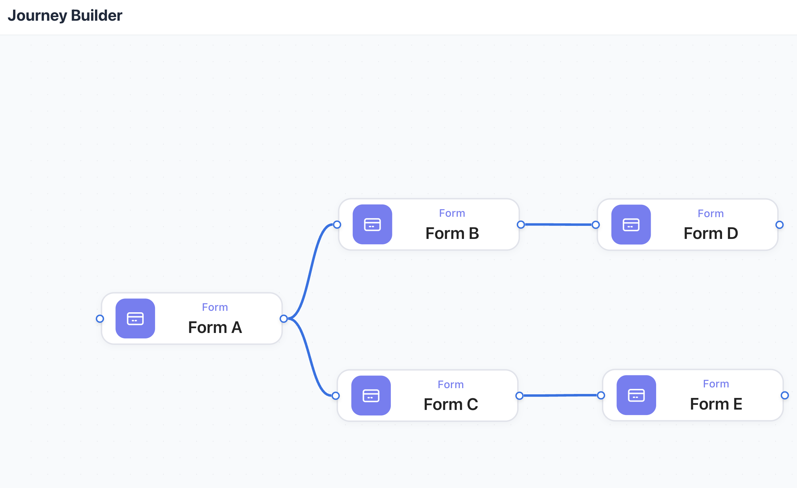
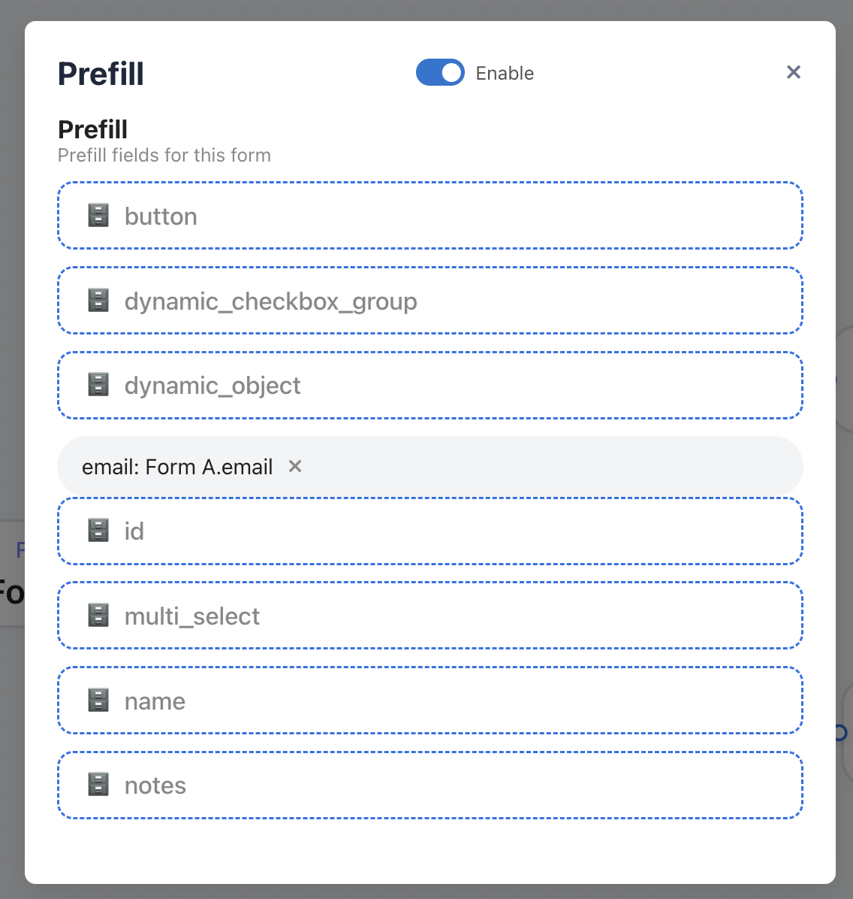
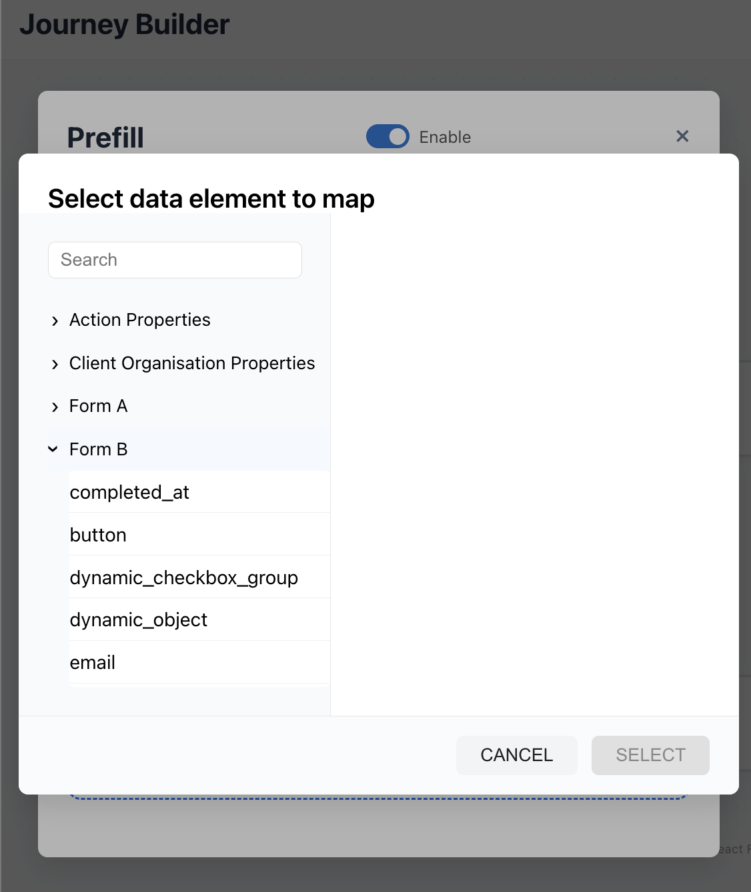

# Avantos Journey Builder

## Overview

A React + Vite + TypeScript implementation of the Avantos Journey Builder challenge. Features a node-based UI for forms, a prefill mapping modal, and dynamic data loading from a mock backend.

---

## Getting Started

### Backend (Mock Server)

- Start the provided `frontendchallengeserver` (see its README for details).


1. Get the full action blueprint graph (main endpoint)
This should return a JSON object with nodes, edges, and forms arrays.

```
curl -X GET http://localhost:3000/api/v1/1/actions/blueprints/1/graph | jq 

```

2. Get just the forms (if supported, otherwise filter client-side)
This will show all forms and their schemas.

```
curl -X GET http://localhost:3000/api/v1/1/actions/blueprints/1/graph | jq '.forms'

```

3. Get just the nodes (if supported, otherwise filter client-side)
'
This will show all nodes, including their type, id, and relationships.

```
curl -X GET http://localhost:3000/api/v1/1/actions/blueprints/1/graph | jq '.nodes'
```


### Frontend

- In this directory, run:
  ```sh
  npm install
  npm run dev
  ```
- The app will be available at [http://localhost:5173](http://localhost:5173).

---

## Code Structure

- `src/components/` — UI components
- `src/services/api.ts` — API calls
- `src/types/` — TypeScript types

---

## Extending Data Sources

To add a new data source to the prefill modal, update `src/components/PrefillModal.tsx` and add your source to the `availableForms` array.

---

## Testing

- Tests: `src/components/__tests__/`
- Run: `npm test`

---




---

## Contact

For questions, contact the project maintainer.
